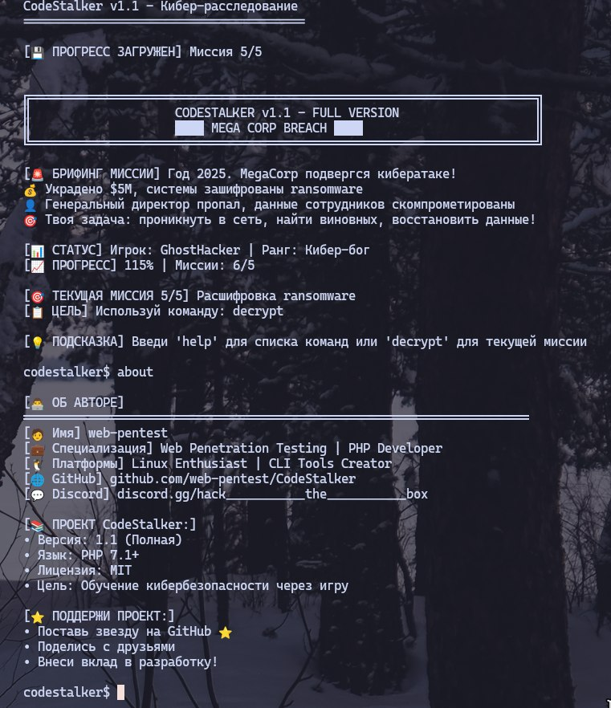

# CodeStalker v1.1 - Кибер-расследование CLI

  
   <em>CodeStalker в действии — сканируй сеть как настоящий хакер!</em>

 

**CodeStalker** — это интерактивная CLI-игра для изучения кибербезопасности!  
Проходи 5 миссий, собирай достижения и спасай корпорацию MegaCorp от кибератаки 2025 года! 🕵️‍♂️

## 🎮 Что это?

Ты — пентестер, нанятый корпорацией MegaCorp для расследования крупнейшей кибератаки.  
Украдено $5M, системы зашифрованы ransomware, CEO пропал!  
Твоя задача — пройти 5 миссий и раскрыть заговор!

### Миссии:
1. **🔍 Сетевая разведка** (`nmap`) — найди уязвимые хосты
2. **🔐 Взлом админ-панели** (`hydra`) — brute-force пароли
3. **💉 SQL-инъекции** (`sqlmap`) — извлеки данные из БД
4. **📧 Социальная инженерия** (`phish`) — фишинг CEO
5. **🔓 Расшифровка ransomware** (`decrypt`) — восстанови данные

## 🚀 Быстрый старт

### Требования:
- PHP 7.1+
- Терминал (Linux/Mac/Windows с WSL)

### Установка:
📌 Клонируй репозиторий
git clone https://github.com/web-pentest/CodeStalker.git
cd CodeStalker
📌 Запусти игру
php codestalker.php

### Управление:
codestalker$ nmap      # Миссия 1: Сканирование сети
codestalker$ hydra     # Миссия 2: Взлом админки
codestalker$ sqlmap    # Миссия 3: SQL-инъекции
codestalker$ phish     # Миссия 4: Фишинг
codestalker$ decrypt   # Миссия 5: Расшифровка

📌 Полезные команды:
codestalker$ help      # Показать справку
codestalker$ whoami    # Твой профиль и достижения
codestalker$ status    # Текущая миссия
codestalker$ about     # Информация о проекте
codestalker$ clear     # Очистить экран
codestalker$ exit      # Выход

## 🏆 Система прогресса

### Ранги:
- **Новичок** (0-19%) — только начинаешь
- **Хактивист** (20-44%) — активист киберпространства
- **Пентестер** (45-69%) — профессионал
- **Элитный хакер** (70-99%) — мастер своего дела
- **Кибер-бог** (100%) — легенда!

### Достижения:
- 🏅 **Разведчик сети** — первая миссия
- 🔑 **Мастер паролей** — взлом админки
- 🕵️ **Корпоративный шпион** — SQL-инъекция
- 🎣 **Мастер социальной инженерии** — успешный фишинг
- 🔓 **Крипто-гений** — расшифровка ransomware

### Концовки:
- **🌟 Легендарная** (<10 мин) — предложение от FBI
- **⭐️ Отличная** (<20 мин) — $250K бонус от MegaCorp  
- **✅ Хорошая** (>20 мин) — сертификат CEH

## 📊 Функции v1.1

### ✨ Новое:
- 💾 Автосохранение — прогресс сохраняется в `save.json`
- 🎨 Цветной прогресс-бар — визуальная обратная связь в терминале
- 📈 Расширенная статистика — время, ранги, достижения
- 🎯 Детальные миссии — реалистичные симуляции популярных хакерских инструментов
- 🛡️ Улучшенная стабильность и исправления багов

### 🔧 Исправления:
- Пофикшен `progressBar()` — устранена ошибка TypeError
- Исправлены проблемы с синтаксисом и скобками
- Устранены ошибки загрузки сохранений

## 🚀 Что дальше?

### Планируется в v1.2+:
- 🌐 Веб-версия на JavaScript/Node.js
- 📱 Мобильная поддержка (Termux)
- 🎵 Звуковые эффекты в терминале
- 🌍 Мультиязычность (EN/RU)
- 🏆 Онлайн-таблица лидеров

---

⭐️ **Поддержи проект став звездочку на GitHub и участвуй в развитии!**

## 📜 Лицензия

Проект распространяется под лицензией [MIT License](LICENSE).  
Свободен для использования и модификаций, при сохранении авторства.

## 👨‍💻 Автор

**web-pentest**  
- 🌐 [GitHub](https://github.com/web-pentest)  
- 💬 [Discord](https://discord.gg/hack___________the___________box)  
- 📧 SOON

---
